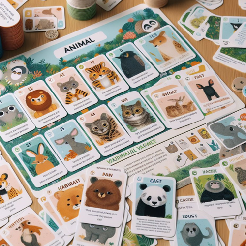

# Animal Quiz Game Program



## Project Overview

The Animal Quiz Game Program is a Python-based quiz game that tests the user's knowledge about animals. The game includes features such as selecting the number of questions, choosing categories (Mammals, Birds, Reptiles, Fish, Insects), selecting difficulty levels (easy, medium, hard), displaying visuals for each question, and providing feedback on correct or incorrect answers.

## Features

- **Number of Questions:**

  - Users can choose the number of questions they want to attempt, with options for 5 or 10 questions.

- **Categories:**

  - Users can select categories such as Mammals, Birds, Reptiles, Fish, and Insects for the quiz.

- **Difficulty Levels:**

  - Users can choose the difficulty level of the quiz, ranging from easy to medium to hard.

- **Visuals:**

  - Visuals, including images related to the quiz questions, are displayed for a more engaging experience.

- **Time Limit:**

  - Users have a time limit of 10 seconds to answer each question, adding an element of challenge.

- **Feedback:**

  - Users receive feedback on whether their answer is correct or incorrect.

- **Final Score:**
  - The final score is displayed based on the number of correct guesses.

## How to Use

1. **Run the Program:**

   - Execute the program to start the Animal Quiz Game.

2. **Select Categories:**

   - Choose one or more categories from the available options (Mammals, Birds, Reptiles, Fish, Insects).

3. **Choose Difficulty Level:**

   - Select the difficulty level for the quiz (easy, medium, hard).

4. **Number of Questions:**

   - Specify the number of questions to attempt (5 or 10).

5. **Answer Questions:**

   - Answer each question within the 10-second time limit.

6. **Feedback:**

   - Receive feedback on whether the answer is correct or incorrect.

7. **Final Score:**
   - View the final score based on the number of correct guesses.

## Example

```bash
cd AnimalQuizGame
python animal_quiz_game.py
```

```python
Welcome to the Animal Quiz Game!

Available Categories:  ['Mammals', 'Birds', 'Reptiles', 'Fish', 'Insects']
Choose a category (or type 'done' to start the quiz):  Mammals
Choose a category (or type 'done' to start the quiz):  Birds
Choose a category (or type 'done' to start the quiz):  done

Choose difficulty level (easy, medium, hard): easy
Enter the number of questions you want to attempt (5 or 10): 5

Animal Quiz - 5 Questions (easy difficulty)
Which bear lives at the North Pole?
Your answer: Polar Bear
Correct Answer!

Which animal is known as the "ship of the desert"?
Your answer: Camel
Correct Answer!

What is the largest big cat in the world?
Your answer: Lion
Sorry! Wrong Answer!! Try again: Tiger
Correct Answer!

Which is the fastest land animal?
Your answer: Cheetah
Correct Answer!

What is the only mammal capable of sustained flight?
Your answer: Bat
Correct Answer!

Your Score is: 5/5
```

## Installation

1. Clone the repository:

   ```bash
   git clone https://github.com/vrm-piyush/AnimalQuizGame.git
   ```

2. Navigate to the project directory:

   ```bash
   cd AnimalQuizGame
   ```

3. Run the program:

   ```bash
   python animal_quiz_game.py
   ```

## Features to be Added

- **Categories:**

  - Introduce additional categories and allow users to create custom categories.

- **Score Tracking:**

  - Keep track of the user's scores across multiple sessions and display their highest scores.

- **Hints:**

  - Add an option for users to request hints or additional information for difficult questions.

- **Visuals:**

  - Enhance the visual experience by including sounds related to animals.

- **Randomized Options:**

  - Shuffle the answer options for multiple-choice questions to increase variability.

- **Interactive Feedback:**

  - Provide more detailed feedback, including explanations for correct or incorrect answers.

- **User Profiles:**
  - Allow users to create profiles, save preferences, and track their progress over time.

## Contribution Guidelines

Contributions are welcome! If you have ideas for improvements or encounter any issues, please open an [issue](https://github.com/vrm-piyush/AnimalQuizGame/issues) or submit a pull request.

---
