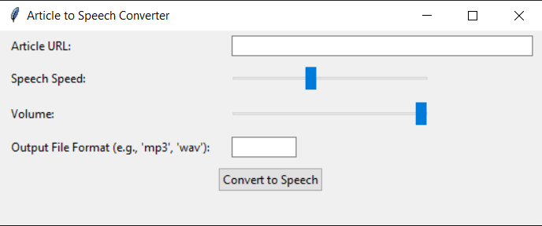

# Article to Speech Converter


## Project Overview

The Article to Speech Converter is a versatile program that allows users to convert articles into speech, providing an accessible way to consume written content. Users can input an article URL, customize speech parameters such as speed and volume, and choose the output file format. The program utilizes the 'newspaper' library for article extraction and 'pyttsx3' for text-to-speech conversion.

## Features

- **Error Handling:**

  - Robust error handling for informative error messages and graceful handling of various exceptions.

- **Voice and Speed Selection:**

  - Users can choose from different voices and set speech speed according to their preferences.

- **Output File Format:**

  - Option to select the output file format (e.g., MP3, WAV) for the generated audio file.

- **User Interface (GUI):**

  - Simple graphical user interface for a more user-friendly experience.

- **Customization:**

  - Users can customize pitch, volume, and other voice parameters.

- **Customizable Hotkeys:**

  - Allow users to define custom hotkeys for various program functions, enhancing accessibility and user control.

- **Logging:**

  - Logging mechanism for tracking articles processed, encountered errors, and user interactions.

## How to Use

1. **Run the Program:**

   - Execute the program and input the URL of the article you want to convert.

2. **Customize Speech:**

   - Adjust speech parameters such as speed and volume using sliders.

3. **Output Format:**

   - Choose the desired output file format (e.g., MP3, WAV).

4. **Convert to Speech:**

   - Click the "Convert to Speech" button to generate the audio file.

5. **Playback:**

   - The program will play the generated audio file automatically.

6. **Optional: Delete Audio File**

   - Choose to delete the audio file after playback.

## Example

```bash
cd ArticleToSpeechConverter
python article_to_speech_converter
```



## Features to be Added

- **Text Summarization:**

  - Summarization feature provides users with a quick overview of the article's content.

- **Multilingual Support:**

  - Support for multiple languages, allowing users to choose the language of their choice.

- **Offline Mode:**

  - Local text-to-speech conversion option for offline usage.

- **Speech Recognition:**

  - Convert spoken words into text using speech recognition for vocal interaction.

- **Batch Processing:**

  - Allow users to input multiple article URLs and process them in batch mode to convert multiple articles to speech.

- **Text-to-Speech Markup:**

  - Support text-to-speech markup languages (e.g., SSML) to enable advanced control over speech synthesis.

## Contribution Guidelines

Contributions are welcome! If you have ideas for improvements or encounter any issues, please open an [issue](https://github.com/vrm-piyush/Acronym/issues) or refer to [contribution guidelines](../CONTRIBUTING.md) for more details.

---
