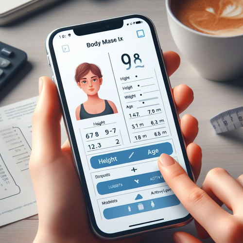

# Body Mass Index (BMI) Calculator 



## Project Overview

The Body Mass Index (BMI) Calculator Program is a Python-based utility that assists users in calculating their BMI based on weight and height inputs. The program supports input in various units, such as kilograms/meters or pounds/inches, and provides color-coded results indicating different weight statuses. Additionally, users have access to a BMI chart for reference.

## Features

- **Unit Selection:**

  - Users can choose whether to input weight and height in kilograms/meters or pounds/inches, with appropriate conversions.

- **Input Validation:**

  - Robust validation ensures that users enter realistic and valid values for weight and height.

- **BMI Categories:**

  - Provides weight status categories such as underweight, normal weight, overweight, and obesity based on the calculated BMI.

- **BMI Chart:**

  - Displays a BMI chart with categories and ranges for users to reference.

- **Color-Coded Results:**
  - Color-coded results visually indicate the BMI category, making it easy for users to interpret.

## How to Use

1. **Run the Program:**

   - Execute the program to start the BMI Calculator.

2. **Enter Weight and Height:**

   - Input weight and height when prompted. Choose the respective units (kg/m or lb/in).

3. **View Results:**

   - The program will display the calculated BMI value and weight status with color-coded results.

4. **BMI Chart:**
   - A BMI chart is provided for reference to understand BMI categories.

## Example

```bash
cd BMICalculator
python bmi_calculator.py
```

```python
Enter your weight: 70
Choose weight unit (kg, lb, g): kg
Enter your height: 1.75
Choose height unit (m, cm, in): m

BMI Chart:
+-----------------+--------------------+
| BMI Category    | BMI Range          |
+-----------------+--------------------+
| Underweight     | BMI < 18.5         |
| Normal Weight   | 18.5 <= BMI < 24.9 |
| Overweight      | 25 <= BMI < 29.9   |
| Obesity         | BMI >= 30          |
+-----------------+--------------------+

Your BMI is 22.857
You are categorized as Normal Weight
```

## Features to be Added

- **Additional BMI Categories:**

  - Expand weight status categories for more detailed classifications.

- **Advice and Recommendations:**

  - Offer personalized advice based on the user's BMI, such as fitness and dietary recommendations.

- **History Tracking:**

  - Implement a feature to track and visualize BMI changes over time.

- **BMI Percentile:**

  - Calculate and display the user's BMI percentile relative to their age and gender group.

- **Language Localization:**

  - Support language localization options for a diverse user base.

- **Integration with Fitness Apps:**

  - Integrate with fitness apps or devices to automate the input of weight and height data.

- **Educational Information:**

  - Include educational content about BMI, its limitations, and factors contributing to overall health.

- **Accessibility Features:**
  - Enhance accessibility by implementing features like voice commands or screen reader compatibility.
  
## Contribution Guidelines

Contributions are welcome! If you have ideas for improvements or encounter any issues, please open an [issue](https://github.com/vrm-piyush/Acronym/issues) or refer to [contribution guidelines](../CONTRIBUTING.md) for more details.

---
