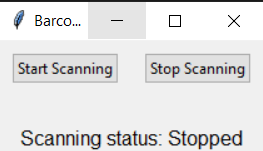

# Barcode and QR Code Reader Program


## Project Overview

The Barcode and QR Code Reader Program is a Python application that provides a graphical user interface (GUI) for scanning and recognizing barcodes and QR codes using a camera feed. Users can start and stop the scanning process, and recognized barcode information is displayed on the camera feed. The program supports customizable scanning status labels, and recognized barcode information is saved along with timestamps to a text file. Additionally, a beep sound is generated on successful scanning (Windows only).

## Features

- **GUI Interface:**

  - Provides a graphical user interface for interactive barcode and QR code scanning.

- **Start and Stop Scanning:**

  - Users can initiate and terminate the scanning process.

- **Recognize and Display Codes:**

  - Recognizes barcodes and QR codes in the camera feed and displays the decoded information.

- **Customizable Scanning Status Labels:**

  - Scanning status labels are customizable, providing flexibility in status display.

- **Save Recognized Information:**

  - Saves recognized barcode information along with timestamps to a text file.

- **Beep Sound on Successful Scanning:**

  - Generates a beep sound on successful scanning (Windows only).

## How to Use

1. **Run the Program:**

   - Execute the program to launch the Barcode and QR Code Reader GUI.

2. **Start Scanning:**

   - Click the "Start Scanning" button to initiate the scanning process.

3. **Stop Scanning:**

   - Click the "Stop Scanning" button to terminate the scanning process.

4. **View Recognized Information:**

   - Recognized barcode information is displayed on the camera feed.

5. **Save Recognized Information:**

   - Recognized barcode information, along with timestamps, is saved to a text file (`result.txt`).

6. **Beep Sound (Windows Only):**

   - A beep sound is generated on successful scanning (Windows only).

## Example

```bash
cd BarcodeQRCodeReader
python barcode_qrcode_reader.py
```

\


```python
# The Barcode and QR Code Reader GUI will be displayed, allowing users to interactively scan and recognize barcodes and QR codes using the camera feed.
# Recognized information is displayed on the camera feed, and additional details are saved to a text file.
# A beep sound is generated on successful scanning (Windows only).
```

## Features to be Added

- **Code Filtering:**

  - Allow the user to filter or ignore certain types of codes.

- **Configuration Options:**

  - Add configuration options for camera selection, resolution settings, etc.

- **Integration with External Systems:**

  - Integrate the program with external systems or databases.

- **Code Filtering based on Location:**

  - Implement location-based filtering for certain codes.


## Contribution Guidelines

Contributions are welcome! If you have ideas for improvements or encounter any issues, please open an [issue](https://github.com/vrm-piyush/Acronym/issues) or refer to [contribution guidelines](../CONTRIBUTING.md) for more details.

---
