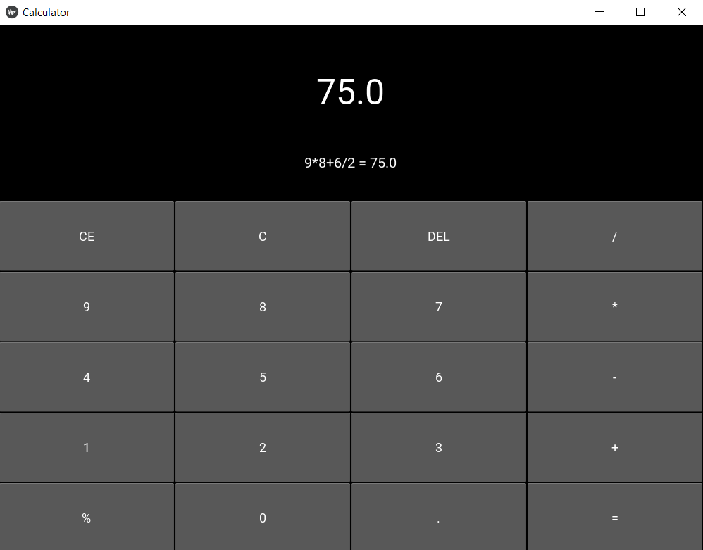

# Calculator GUI Program


## Project Overview

The Calculator GUI Program is a Python application that implements a basic calculator with a graphical user interface (GUI) using the Kivy framework. The calculator supports arithmetic operations such as addition, subtraction, multiplication, and division. It provides buttons for digits (0-9), a decimal point, percentage, and common arithmetic operators. Additionally, special buttons for clearing the entire input, clearing the current input, and deleting the last character are included. The current calculation is displayed on the screen, and a scrollable area shows the calculation history with results.

## Features

- **Basic Arithmetic Operations:**

  - Addition, subtraction, multiplication, and division.

- **Numeric Buttons:**

  - Buttons for digits 0-9, a decimal point, and percentage.

- **Special Buttons:**

  - CE (Clear All), C (Clear), DEL (Delete), and = (Evaluate).

- **Calculation History:**

  - Display of calculation history in a scrollable area.

## How to Use

1. **Run the Program:**

   - Execute the program to launch the Calculator GUI.

2. **Calculator Interface:**

   - The GUI features an output label at the top for the current calculation and a scrollable area below for the calculation history.

3. **Numeric Input:**

   - Click on the numeric buttons to input digits, the decimal point, or percentage.

4. **Arithmetic Operations:**

   - Click on the corresponding buttons (+, -, \*, /) to perform arithmetic operations.

5. **Special Buttons:**

   - CE (Clear All): Clears the entire input and history.
   - C (Clear): Clears the current input.
   - DEL (Delete): Removes the last character from the input.
   - = (Evaluate): Calculates the result.

6. **History Display:**

   - The calculation history is displayed below the current calculation. Scroll to view more entries.

## Example

```bash
cd CalculatorGUI
python calculator.py
```



## Features to be Added

- **Scientific Calculator Functions:**

  - Include additional scientific calculator functions such as square root, exponentiation, trigonometric functions (sin, cos, tan), logarithms, etc.

- **Memory Functions:**

  - Add memory-related functions like Memory Recall (MR), Memory Store (MS), Memory Clear (MC), and Memory Add (M+).

- **History Navigation:**

  - Allow users to navigate through the calculation history and recall or edit previous calculations.

- **Themes and Styles:**

  - Implement different themes and styles for the calculator, allowing users to customize the appearance.

- **Keyboard Support:**

  - Enable keyboard input for the calculator to enhance usability.

- **Copy-Paste Support:**

  - Allow users to copy and paste values to and from the calculator.

- **Floating Point Precision Control:**

  - Add an option to control the number of decimal places displayed in the result.

- **Error Handling:**

  - Improve error handling and display meaningful messages for various types of errors.

- **Unit Conversion:**

  - Integrate unit conversion functionality for common units (length, weight, temperature, etc.).

- **Expression History:**

  - Keep track of the entire expression entered by the user, not just the results.

- **Settings Panel:**

  - Include a settings panel where users can configure calculator preferences.

- **Resizable Fonts:**

  - Allow users to resize the font for better visibility.

- **Accessibility Features:**

  - Implement accessibility features such as voice output for the visually impaired.

- **Advanced Layouts:**

  - Explore different layouts, like a scientific calculator layout or a more compact layout.

- **Help/About Section:**

  - Provide a help or about section to guide users on how to use the calculator and display version information.

## Contribution Guidelines

Contributions are welcome! If you have ideas for improvements or encounter any issues, please open an [issue](https://github.com/vrm-piyush/Acronym/issues) or refer to [contribution guidelines](../CONTRIBUTING.md) for more details.

---
