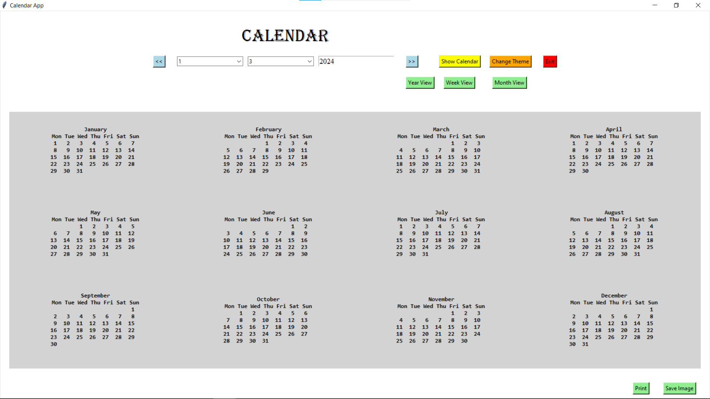
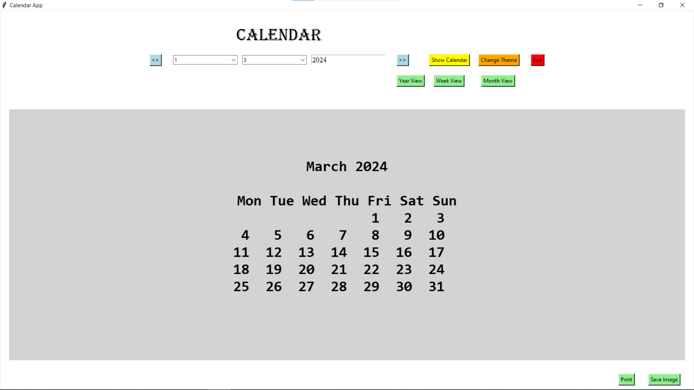

# Calendar App with GUI in Python


## Project Overview

The Calendar App with GUI in Python is a user-friendly application that allows users to view and manage their schedules interactively. It provides features such as year, month, and week view modes, navigation buttons for easy browsing, a customizable theme, date picking options, and the ability to save the calendar as an image or print it. Additionally, the app highlights holidays and allows users to switch between different views effortlessly.

## Features

- **Navigation Buttons:**

  - Easily navigate to the previous and next years using dedicated buttons.

- **Resizable Window:**

  - Resize the window to fit your screen or preferences while maintaining a responsive layout.

- **Date Picker:**

  - Select a specific date using dropdown menus for day, month, and year, updating the calendar display accordingly.

- **Customizable Themes:**

  - Choose from different color themes or customize the appearance of the calendar with a user-friendly theme changer.

- **Week View:**

  - Switch between month and week views, allowing for a detailed display of individual days and their corresponding events.

- **Print Functionality:**

  - Print the displayed calendar for offline use, ensuring a clear and readable output.

## How to Use

1. **Run the Program:**

   - Execute the program to launch the Calendar App.

2. **Navigation:**

   - Use the "<<", ">>", and "Today" buttons to navigate to the previous year, next year, and current date, respectively.

3. **Date Picker:**

   - Select a specific date by choosing the day, month, and year from the dropdown menus.

4. **View Modes:**

   - Switch between "Year View," "Month View," and "Week View" using the corresponding buttons.

5. **Customize Theme:**

   - Click on the "Change Theme" button to customize the app's appearance with your preferred colors.

6. **Print and Save:**

   - Print the calendar or save it as an image using the "Print" and "Save Image" buttons.

## Example

```bash
cd CalendarApp
python calendar_app.py
```



\


## Features to be Added

- **Today Button:**

  - Jump to the current month or today's date with a dedicated "Today" button.

- **Event Reminders:**

  - Add, edit, and delete events or reminders for specific dates, and view them directly on the calendar.

- **Holidays Highlighting:**

  - Holidays and special days are automatically highlighted on the calendar, providing a clear visual distinction.

- **Export/Import:**

  - Export and import calendar data for backup or sharing with others, providing flexibility and data management.

- **Search Functionality:**

  - Easily find specific events or dates within the calendar using the search box.

- **Reminders/Notifications:**

  - Receive optional reminders or notifications for upcoming events, ensuring you never miss an important date.

## Contribution Guidelines

## Contributions are welcome! If you have ideas for improvements or encounter any issues, please open an [issue](https://github.com/vrm-piyush/Acronym/issues) or refer to [contribution guidelines](../CONTRIBUTING.md) for more details.
