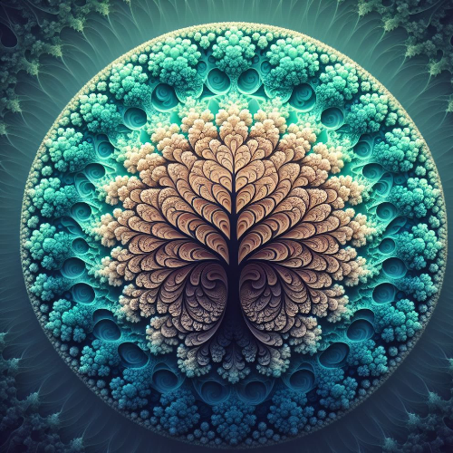

# Circular Fractal Tree Program



## Project Overview

The Circular Fractal Tree Program is a Python program using the Turtle graphics library to draw a mesmerizing and colorful circular fractal tree. The program allows customization of the background pattern or texture and features background music using pygame mixer. Additionally, it provides an option to save the generated turtle graphics window as an image file.

## Features

- **Fractal Tree Drawing:**

  - Draws a circular fractal tree with colorful branches recursively.

- **Colorful Branches:**

  - Utilizes a variety of colors for the branches to create a visually appealing pattern.

- **Background Music:**

  - Plays background music during the drawing process using pygame mixer.

- **Background Patterns:**

  - Offers options to draw simple background patterns or custom background textures.

- **Image Saving:**
  - Allows users to save the turtle graphics window as an image file (e.g., PNG or JPEG).

## How to Use

1. **Run the Program:**

   - Execute the program to start the Fractal Tree Program.

2. **Interaction:**

   - Watch the mesmerizing circular fractal tree being drawn.
   - Optionally, customize background patterns or textures.
   - Enjoy the background music.

3. **Save as Image:**
   - Once the drawing is complete, the program will save the turtle graphics window as an image file (`fractal_tree.png`).

## Example

```bash
python circular_fractal_tree.py
```

```python
# Circular Fractal Tree animation will be displayed in the Turtle graphics window.
# Customize the program by adjusting parameters and enjoy the interactive experience.
# The program will save the fractal tree as an image file (fractal_tree.png) upon completion.
```

## Installation

1. **Clone the Repository**:

   ```bash
   git clone https://github.com/vrm-piyush/CircularFractalTree.git
   ```

2. **Navigate to the Project Directory:**

   ```bash
   cd CircularFractalTree
   ```

3. **Run the Program:**

   ```bash
   python circular_fractal_tree.py
   ```

## Features to be Added

- **Randomized Colors:**

   - Randomly select colors for each branch to create dynamic and diverse patterns.

- **Variable Branch Angles:**

   - Allow user input for custom angles, providing flexibility in the tree's structure.

- **Customizable Tree Depth:**

   - Enable users to specify the depth or number of recursive levels for a more intricate pattern.

- **User Interaction:**

   - Implement mouse or keyboard interactions for dynamic adjustments during runtime.

- **Gradient Colors:**

   - Create a gradient effect for branch colors, transitioning smoothly from one color to another.

- **Spiral Patterns:**

   - Experiment with modifying angles and lengths to create captivating spiral patterns.

- **Seasonal Themes:**

   - Adjust colors and patterns based on seasons for a visually appealing theme.

- **Customizable Trunk:**

   - Allow users to customize the appearance of the trunk, such as its length, thickness, and color.

## Contribution Guidelines

Contributions to enhance the Circular Fractal Tree Program are welcome! If you have ideas or encounter any issues, please open an [issue](https://github.com/vrm-piyush/CircularFractalTree/issues) or submit a pull request.

---
