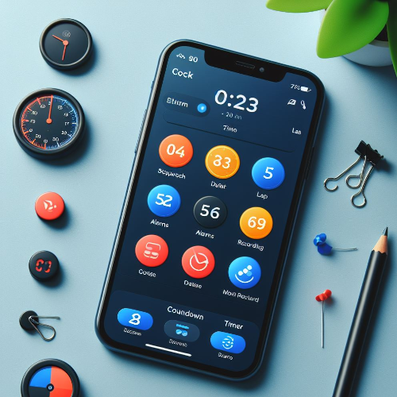
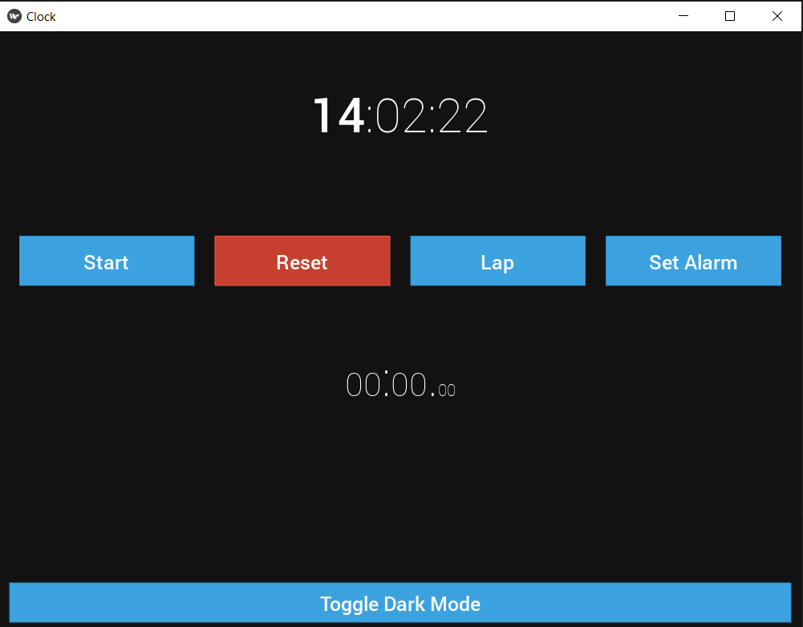

# Clock App Program



## Project Overview

The Clock App Program is a versatile time management application with features like a stopwatch, countdown timer, alarms, lap recording, and more. It aims to provide users with a comprehensive tool for managing their time effectively. The app includes a user-friendly interface with options for customization and different themes.

## Features

- **Enhance Stopwatch Display:**

  - Format the stopwatch display to be more user-friendly, with clear labels for minutes, seconds, and milliseconds.

- **Stopwatch Lap Times:**

  - Extend the stopwatch feature to record and display lap times.
  - Implement a button to mark lap times during stopwatch operation.

- **Sound Effects:**

  - Integrate sound effects for button clicks, stopwatch actions, or alarms.

- **Add Alarm Functionality:**

  - Allow users to set alarms with customizable sounds or notifications.
  - Implement a feature to handle alarm triggers.

- **Dark Mode Support:**

  - Add support for dark mode to reduce eye strain during nighttime usage.
  - Allow users to toggle between light and dark modes.

- **Responsive Design:**

  - Ensure that the app layout scales well on different screen sizes and orientations.

- **Accessibility:**

  - Consider accessibility features, such as ensuring the app works well with screen readers.

- **Documentation:**

  - Provide clear documentation on how to use the app and any available features.

## How to Use

1. **Run the Program:**

   - Execute the script to launch the clock app with the specified features.

2. **Interact with the App:**

   - Explore the different features such as stopwatch, countdown timer, alarms, and themes.
   - Customize settings through the settings panel.
   - Test the app's responsiveness on various devices.

## Example

```bash
    cd Clock-app
    python clock_app.py
```



## Features to be Added

- **Countdown Timer:**

  - Include a countdown timer feature that allows users to set a specific duration.
  - Provide visual and audible notifications when the timer reaches zero.

- **Themes and Customization:**

  - Implement different themes or color schemes for the clock interface.
  - Allow users to customize the font style, size, and background.

- **Settings Panel:**

  - Create a settings panel where users can configure various aspects of the app.
  - Include options for sound settings, date/time formats, and notification preferences.

- **Resizable Widgets:**

  - Allow users to resize and reposition clock widgets on the screen.
  - Implement a user-friendly interface for widget management.

- **Multiple Alarms:**

  - Allow users to set multiple alarms with different labels and notification sounds.
  - Implement the ability to enable/disable specific alarms.

- **World Clock:**

  - Add a world clock feature to display time from different time zones.
  - Allow users to add and customize multiple locations.

- **Reminder Feature:**

  - Enable users to set simple reminders for specific times or events.
  - Display reminder notifications with customizable messages.

- **Calendar Integration:**

  - Integrate with the device's calendar to display upcoming events or appointments.
  - Provide notifications for scheduled events.

- **Task Manager Integration:**

  - Integrate with task management tools to display upcoming tasks or deadlines.
  - Provide notifications for approaching due dates.

- **User Profiles:**

  - Allow users to create profiles with personalized clock configurations.
  - Switch between profiles based on different user preferences.

- **Weather Information:**

  - Integrate a weather module to display current weather conditions or forecasts.
  - Allow users to set their location for weather updates.

- **Localization:**

  - Add support for multiple languages to make the app accessible to a broader audience.

- **Persistent Data:**

  - Save user preferences, such as chosen settings or alarms, so they persist between app sessions.

- **Testing:**

  - Perform thorough testing on various devices to identify and fix any issues.
  - Consider beta testing with a user group to gather feedback for further improvements.

## Contribution Guidelines

Contributions are welcome! If you have ideas for improvements or encounter any issues, please open an [issue](https://github.com/vrm-piyush/Python-Projects/issues/new/choose) or refer to [contribution guidelines](../CONTRIBUTING.md) for more details.

---
