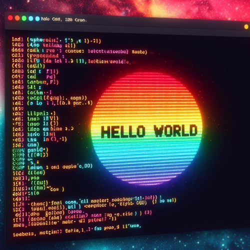

# Colored Text Printer Program



## Project Overview

The Colored Text Printer Program is a Python-based utility that allows users to input multiple lines of text with customized colors and styles. The program provides a menu for choosing text color, background color, and text styles, ensuring a visually appealing display of colored text. Additionally, users have the option to save the colored text as an HTML file for further use.

## Features

- **Colorful Text:**

  - Users can input multiple lines of text with customized text color, background color, and text styles.

- **Color Choices:**

  - The program offers a menu for users to choose from various text colors, background colors, and text styles.

- **Validation:**

  - User input is validated to ensure that chosen colors and styles are valid options.

- **Colorama Integration:**

  - The [Colorama](https://pypi.org/project/colorama/) library is used to simplify colored text printing.

- **HTML Output:**
  - Users can choose to save the colored text as an HTML file for further usage.

## How to Use

1. **Run the Program:**

   - Execute the program to start the Colored Text Printer.

2. **Enter Text:**

   - Input lines of text when prompted. Type "done" when finished.

3. **Choose Colors and Styles:**

   - For each line, choose the text color, background color, and text styles.

4. **Print Colored Text:**

   - The program will display the entered text with the specified colors and styles.

5. **Save as HTML (Optional):**
   - Users have the option to save the colored text as an HTML file.

## Example

```bash
cd ColoredTextPrinter
python colored_text_printer.py
```

```python
Enter a line of text (or type "done" to finish): Hello, World!
Choose text color:
Options: BLACK, RED, GREEN, YELLOW, BLUE, MAGENTA, CYAN, WHITE
RED
Choose background color:
Options: BLACK, RED, GREEN, YELLOW, BLUE, MAGENTA, CYAN, WHITE
YELLOW
Choose text styles (comma-separated, e.g., BRIGHT,UNDERLINE):
Options: BRIGHT, DIM, NORMAL, RESET_ALL: BRIGHT
Enter a line of text (or type "done" to finish): Python is awesome!
Choose text color:
Options: BLACK, RED, GREEN, YELLOW, BLUE, MAGENTA, CYAN, WHITE
CYAN
Choose background color:
Options: BLACK, RED, GREEN, YELLOW, BLUE, MAGENTA, CYAN, WHITE
MAGENTA
Choose text styles (comma-separated, e.g., BRIGHT,UNDERLINE):
Options: BRIGHT, DIM, NORMAL, RESET_ALL: BRIGHT
Enter a line of text (or type "done" to finish): done
```
Printing Colored Text:

<span style="color: red; background-color: yellow; font-weight: bold;">Hello, World!</span>
<span style="color: cyan; background-color: magenta; font-weight: bold;">Python is awesome!</span>
```python
Do you want to save this as HTML? (y/n): y
Enter the HTML filename (e.g., colored_text_output.html): colored_text_output.html
Colored text saved as colored_text_output.html
```

## Features to be Added

- **Additional Colors:**

  - Expand the color options, including bright variants for more vibrant displays.

- **Color Reset:**

  - Implement an option to reset the color to the default after printing colored text.

- **Custom Color Choices:**

  - Allow users to enter custom color codes (RGB values) for precise color selection.

- **Interactive Color Selection:**

  - Enhance user experience by implementing an interactive menu for color selection.

- **Color Preview:**

  - Display a preview of the chosen colors before printing the text.

## Contribution Guidelines

Contributions are welcome! If you have ideas for improvements or encounter any issues, please open an [issue](https://github.com/vrm-piyush/Acronym/issues) or refer to [contribution guidelines](../CONTRIBUTING.md) for more details.

---
