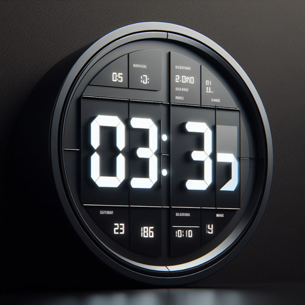
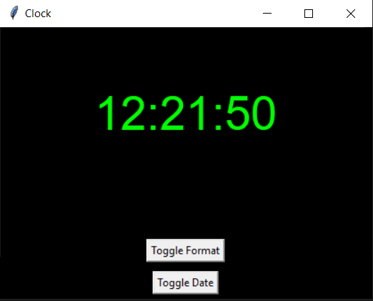

# Digital Clock using GUI Program



## Project Overview

The Digital Clock using GUI Program is a Python application built with the Tkinter library to create a graphical user interface that displays the current time and, optionally, the date. The digital clock supports a customizable time format (12-hour or 24-hour) and allows users to toggle the display of the date. The interface provides a simple and intuitive way for users to view real-time updates of the clock.

## Features

- **Digital Clock Display:**
  - The program showcases a digital clock with a customizable font and color scheme.

- **Time Format Toggle:**
  - Users can switch between 12-hour and 24-hour time formats by clicking the "Toggle Format" button.

- **Date Display Toggle:**
  - The "Toggle Date" button allows users to display or hide the current date beneath the clock.

- **Real-Time Updates:**
  - The clock updates in real-time, providing an accurate representation of the current time.

## How to Use

1. **Run the Program:**
   - Execute the program to launch the Digital Clock GUI.

2. **Toggle Time Format:**
   - Click the "Toggle Format" button to switch between 12-hour and 24-hour time formats.

3. **Toggle Date Display:**
   - Click the "Toggle Date" button to display or hide the current date beneath the clock.

4. **Close the Program:**
   - Close the program window to exit the Digital Clock GUI.

## Example

```bash
cd DigitalClockGUI
python digital_clock_gui.py
```
\


## Installation

1. **Clone the Repository:**

   ```bash
   git clone https://github.com/vrm-piyush/DigitalClockGUIProgram.git
   ```

2. **Navigate to the Project Directory:**

   ```bash
   cd DigitalClockGUI
   ```

3. **Run the Program:**

   ```bash
   python digital_clock_gui.py
   ```

## Features to be Added

- **Time Zone Selection:**
  - Allow users to choose a different time zone for display, accommodating users in various regions.

- **Resizable Window:**
  - Enable users to dynamically resize the application window, adjusting font size and elements accordingly.

- **Theme Options:**
  - Implement different color themes or allow users to customize the background and foreground colors.

- **Alarm Feature:**
  - Include an alarm feature where users can set an alarm for a specific time, triggering a notification or sound.

- **Background Image:**
  - Allow users to set a background image for the digital clock window, personalizing the interface.

- **Multiple Clocks:**
  - Support displaying multiple clocks for different time zones simultaneously, providing a global view.

- **Automatic Dark Mode:**
  - Implement automatic dark mode detection and switching based on system time or user preferences.

- **Weather Information:**
  - Integrate an API to display real-time weather information alongside the clock for enhanced utility.

- **System Tray Icon:**
  - Minimize the application to the system tray, offering convenient access options.

- **Digital Clock Settings:**
  - Create a settings menu allowing users to customize font, colors, and other preferences.

- **Digital and Analog Clock Views:**
  - Provide an option to switch between digital and analog clock views, catering to user preferences.

- **Localization:**
  - Add support for multiple languages, enabling users to choose their preferred language for the interface.

## Contribution Guidelines

Contributions are welcome! If you have ideas for improvements or encounter any issues, please open an [issue](https://github.com/vrm-piyush/DigitalClockGUIProgram/issues) or submit a pull request.

---