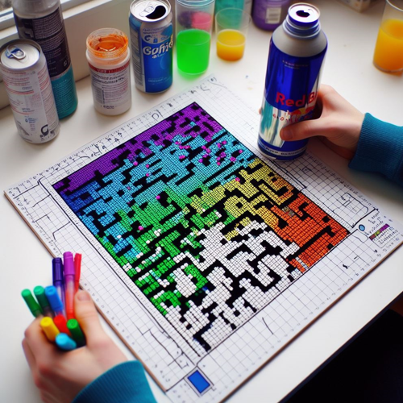

# Conway's Game of Life Program



## Project Overview

Conway's Game of Life is a classic cellular automaton devised by mathematician John Conway in 1970. The Game of Life is not a traditional game with players and a win/lose condition. Instead, it's a simulation where a grid of cells evolves over time based on simple rules. Each cell can be in one of two states, alive or dead, and the evolution of the grid is determined by the states of neighboring cells.

---

## Description of the Game of Life

### Rules

1. **Underpopulation**: Live cell with fewer than two live neighbors dies.
2. **Survival**: Live cell with two or three live neighbors survives.
3. **Overpopulation**: Live cell with more than three live neighbors dies.
4. **Reproduction**: Dead cell with exactly three live neighbors becomes alive.

### How to "Play"

1. **Initialization**: Start with an initial grid of cells.
2. **Evolution**: Apply the rules iteratively to evolve the grid.
3. **Observation**: Watch patterns emerge, change, or stabilize.
4. **Interactivity**: Modify initial configurations or parameters for different outcomes.

### Key Concepts

- **Cells**: Each cell can be alive or dead.
- **Generations**: The game evolves in discrete time steps.
- **Patterns**: Includes stable patterns, oscillators, gliders, etc.

## Conclusion

Conway's Game of Life is a fascinating exploration of emergent behavior, complexity theory, and cellular automata. The Game of Life showcases how simple rules can lead to intricate and unpredictable patterns, making it a captivating study in mathematics and computer science.

---

## Features

- **Game Board Initialization**

  - Initializes the game board with random cell values.

- **Game Board Drawing**

  - Draws the game board based on the current cell values using Pygame.

- **Conway's Game of Life Rules**

  - Applies the rules of Conway's Game of Life to evolve the board to the next generation.

- **Continuous Board Update and Display**

  - Continuously updates and displays the board, creating the simulation.

## How to Use

1. **Run the Program:**

   - Execute the program to launch the Conway's Game of Life simulation.

2. **Enjoy the Game:**

   - Observe the evolution of the cellular automaton on the display window.

## Example

```bash
cd GameOfLife
python game_of_life.py
```

<video width="320" height="240" controls>
  <source src="GameofLife.mp4" type="video/mp4">
</video>

---

## Features to be Added

- **User Interaction:**

  - Allow users to interact with the simulation, such as pausing, resetting, or manually toggling the state of individual cells.

- **Custom Rules:**

  - Implement a feature that lets users define custom rules for the cellular automaton, allowing for different variations of the Game of Life.

- **Pattern Editor:**

  - Provide a pattern editor that allows users to draw and place custom patterns on the grid.

- **Random Seed:**

  - Add an option to randomize the initial state of the board with a specific seed, allowing users to reproduce interesting patterns.

- **Variable Speed:**

  - Allow users to control the speed of the simulation, enabling them to observe the evolution at different rates.

- **Zoom In/Out:**

  - Implement zoom functionality to explore different regions of the grid in more detail.

- **Color Themes:**

  - Provide options for different color themes or visual styles to make the simulation more visually appealing.

- **Statistics Display:**

  - Show statistics such as the current generation number, the number of live cells, or any other relevant metrics.

- **Save/Load Patterns:**

  - Allow users to save and load specific patterns or configurations to study or share interesting setups.

- **Screen Wraparound:**

  - Implement a wraparound feature, where cells on the edges of the grid consider cells on the opposite edge as neighbors.

- **Pattern Library:**

  - Include a library of predefined patterns or famous Game of Life configurations that users can explore.

- **Dynamic Rules:**

  - Allow users to dynamically change the rules during the simulation, providing a more interactive experience.

- **Multiple Simulations:**

  - Enable users to run multiple simulations concurrently, each with its own set of rules or initial conditions.

- **Generational History:**

  - Store and display the history of generations, allowing users to rewind and review past states of the simulation.

- **Cell Information Tooltip:**

  - Display information about the state and age of cells when hovering over them.

- **Mouse Interaction:**

  - Allow users to draw or erase cells directly using mouse interaction.

- **Sound Effects:**

  - Add sound effects to certain events, such as cell births or deaths.

- **Responsive Design:**

  - Ensure that the program has a responsive design that works well on various screen sizes.

- **Documentation and Help:**

  - Include documentation or a help section explaining the rules, controls, and features of the program.

- **Parallel Processing:**

  - Explore parallel processing techniques to improve performance, especially for larger grid sizes.

## Contribution Guidelines

Contributions are welcome! If you have ideas for improvements or encounter any issues, please open an [issue](https://github.com/vrm-piyush/Acronym/issues) or refer to [contribution guidelines](../CONTRIBUTING.md) for more details.

## License

This Conway's Game of Life program is licensed under the Apache License - see the [LICENSE](../LICENSE.md) file for details.

## Acknowledgments

- John Conway for creating the Game of Life and introducing the concept of cellular automata.
- Pygame community for providing a versatile library for game development with Python.

Enjoy exploring the mesmerizing world of Conway's Game of Life!

---
