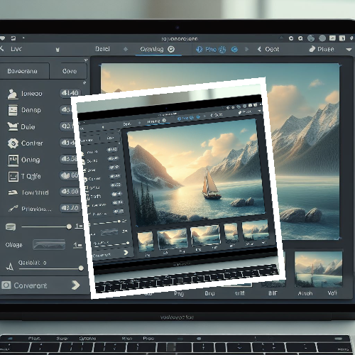
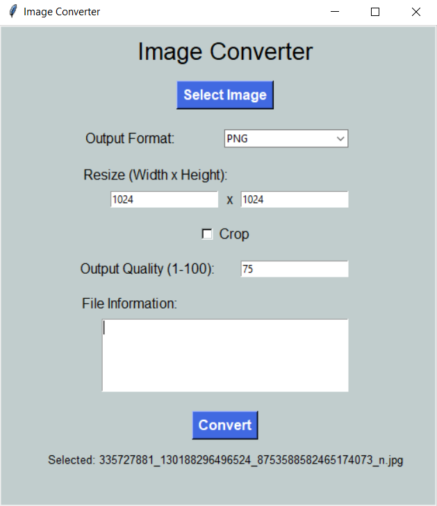

# Image Converter GUI Program



## Project Overview

The Image Converter GUI Program is a Python application that facilitates the conversion of image files from one format to another. The program features a graphical user interface (GUI) built using the Tkinter library. Users can select an image file, choose the output format (JPEG, PNG, GIF, BMP, TIFF), and apply additional options such as resizing, cropping, and adjusting output quality.

## Features

- **Image Selection:**

  - Open a file dialog to choose an image file (PNG, JPG, JPEG, GIF, BMP, TIFF).

- **Output Format:**

  - Options to select the desired output format (JPEG, PNG, GIF, BMP, TIFF).

- **Resize and Crop:**

  - Allow users to resize the image by specifying width and height.
  - Option to crop the image, including a checkbox for enabling or disabling cropping.

- **Output Quality:**

  - For JPEG format, users can set the output quality on a scale from 1 to 100.

- **File Information:**

  - Display information about the selected image, including dimensions, file size, and color mode.

- **Conversion Status:**
  - Provide status updates for successful or failed conversions.

## How to Use

1. **Run the Program:**

   - Execute the program to launch the Image Converter GUI.

2. **Select Image:**

   - Click the "Select Image" button to open a file dialog and choose the input image.

3. **Choose Output Format:**

   - Use the drop-down menu to select the desired output format for the converted image.

4. **Resize and Crop (Optional):**

   - Enter width and height values for resizing.
   - Check the "Crop" option if you want to crop the image.

5. **Set Output Quality (JPEG Only):**

   - If converting to JPEG, set the output quality on a scale from 1 to 100.

6. **Convert:**

   - Click the "Convert" button to initiate the conversion process.

7. **View Information:**

   - After conversion, view information about the converted image, including dimensions, file size, and color mode.

8. **Repeat or Exit:**
   - Decide whether to convert another image or exit the program.

## Example

```bash
cd ImageConverter
python image_converter.py
```



## Installation

1. **Clone the Repository:**

   ```bash
   git clone https://github.com/vrm-piyush/ImageConverter.git
   ```

2. **Navigate to the Project Directory:**

   ```bash
   cd ImageConverter
   ```

3. **Install Dependencies:**

   ```bash
   pip install Pillow
   ```

4. **Run the Program:**

   ```bash
   python image_converter.py
   ```

## Features to be Added

- **Supported Formats:**

  - Allow users to choose from a wider range of output formats beyond JPEG, PNG, GIF, BMP, and TIFF.

- **Preview:**

  - Provide a preview of the selected image before and after conversion.

- **Batch Conversion:**

  - Allow users to convert multiple images at once.

- **Drag and Drop:**

  - Implement drag-and-drop functionality for selecting images.

- **Undo/Redo:**

  - Add undo and redo functionality for actions like conversion or resizing.

- **Themes:**

  - Allow users to choose different color themes for the GUI.

## Contribution Guidelines

Contributions are welcome! If you have ideas for improvements, encounter any issues, or want to add new features, please open an [issue](https://github.com/vrm-piyush/ImageConverter/issues) or submit a pull request.

---
