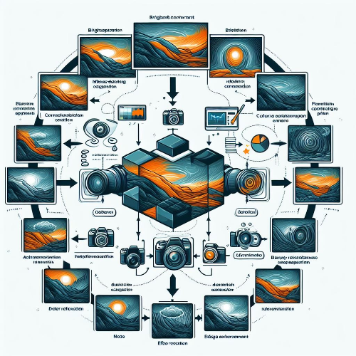
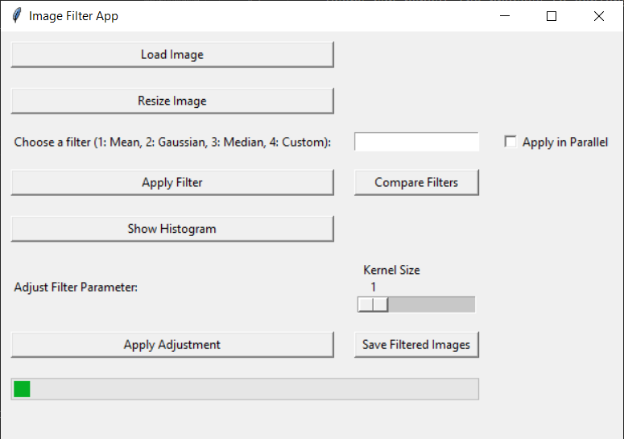

# Image Filtering Program



## Project Overview

The Image Filtering Program is a versatile tool designed to process images with various filters. This program allows users to load images, apply different filters, visualize results, and save filtered images. With a user-friendly interface, it provides a range of features to enhance and analyze images.

## Features

- **Load Image:**

  - Load an image file (jpg, jpeg, png).

- **Resize Image:**

  - Resize the loaded image by a factor of 0.5.

- **Choose Filter:**

  - Select a filter type (1: Mean, 2: Gaussian, 3: Median, 4: Custom).

- **Apply Filter:**

  - Apply the selected filter to the image.

- **Apply in Parallel:**

  - Choose whether to apply the filter in parallel using multi-threading.

- **Compare Filters:**

  - Compare the original image with multiple filtered versions.

- **Show Histogram:**

  - Display histograms for the original and filtered images.

- **Adjust Filter Parameter:**

  - Modify the parameter (kernel size) of the selected filter.

- **Apply Adjustment:**

  - Apply the filter with the adjusted parameter.

- **Save Filtered Images:**

  - Save the filtered color and grayscale images in a 'filtered' folder.

- **Progress Bar:**

  - Show a progress bar during filter application.

- **Message Label:**

  - Display informative messages and errors.

## How to Use

1. **Load Image:**

   - Click on "Load Image" to select an image file.

2. **Resize Image:**

   - Optionally, click on "Resize Image" to resize the loaded image.

3. **Choose Filter:**

   - Enter the filter choice (1-4) in the corresponding entry field.

4. **Apply Filter:**

   - Click on "Apply Filter" to apply the selected filter.

5. **Apply in Parallel:**

   - Check the "Apply in Parallel" checkbox if parallel processing is desired.

6. **Explore Other Features:**

   - Compare filters, show histograms, adjust parameters, and save filtered images.

## Example

```bash
cd ImageFiltering
python image_filter_app.py
```



## Installation

1. **Clone the Repository:**

   ```bash
   git clone https://github.com/vrm-piyush/ImageFilter.git
   ```

2. **Navigate to the Project Directory:**

   ```bash
   cd ImageFilter
   ```

3. **Install Dependencies:**
   Ensure that the necessary libraries are installed. You can use the following command:

   ```bash
   pip install opencv-python matplotlib numpy
   ```

4. **Run the Program:**

   ```bash
   image_filter_app.py
   ```

## Feature to be Added

- **Interactive Filter Parameter Adjustment:**

  - Allow users to interactively adjust parameters of the chosen filter and observe real-time effects.

- **Batch Processing:**

  - Allow users to process multiple images in a batch.

- **Undo/Redo Functionality:**

  - Implement the ability to undo or redo filter actions, enabling users to navigate through different filter choices and compare results.

- **Additional Filters:**

  - Expand the filter options by including more sophisticated or custom filters. You might explore filters used in image processing applications, such as edge detection filters, sharpening filters, or custom convolution filters.

## Contribution Guidelines

Contributions are welcome! If you have ideas for improvements, encounter any issues, or want to add new features, please open an [issue](https://github.com/vrm-piyush/ImageFilter/issues) or submit a pull request.

---
