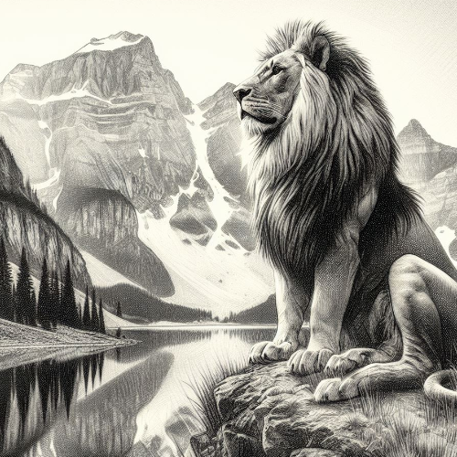
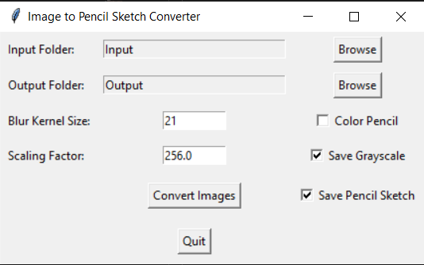

# Image to Pencil Sketch Program



## Program Overview

The Image to Pencil Sketch Program is designed to convert images into pencil sketches. It provides a set of features to display intermediate steps such as grayscale, inversion, and blurred images, allowing users to understand the transformation process. Additionally, the program allows users to save the resulting pencil sketch and provides options for batch processing and a GUI for interactive image-to-pencil-sketch conversion.

## Features

- **Display Image:**

  - Display the input image in a window for visual inspection.

- **Save Image:**

  - Save the resulting pencil sketch to a specified output path.

- **Conversion Steps:**

  - Display intermediate steps, including grayscale, inversion, and blurred images, to show the progression of the pencil sketch transformation.

- **Batch Processing:**

  - Process all images in a specified input folder and save the resulting pencil sketches.

- **GUI for Interactive Conversion:**

  - Implement a graphical user interface (GUI) for interactive image-to-pencil-sketch conversion.
  - Allow users to select input and output folders, adjust parameters, and convert images.

## How to Use

- **Run the Program:**

  - Execute the script, and a GUI will appear for selecting input and output folders, setting parameters, and converting images.

- **GUI Usage:**
  - Browse and select the input and output folders.
  - Adjust parameters such as blur kernel size, scaling factor, and color pencil option.
  - Choose whether to save the grayscale image and the final pencil sketch.
  - Click the "Convert Images" button to initiate the conversion process.

## Example

```bash
cd ImageToPencilSketch
python image_to_pencil_sketch.py
```

\


## Features to be Added

- **Image Previews:**

  - Display previews of intermediate steps alongside the final pencil sketch in the GUI.

- **Image Cropping:**

  - Implement image cropping functionality to focus on specific regions of the input image or the final pencil sketch.

- **Undo/Redo Functionality:**

  - Provide undo and redo functionality for users to navigate through different parameter settings or revert to the original image.

- **Image Filtering:**

  - Experiment with different image filtering techniques to achieve various artistic effects beyond a simple pencil sketch.

- **Integration with Social Media:**

  - Allow users to share their pencil sketches directly on social media platforms.

## Contribution Guidelines

## Contributions are welcome! If you have ideas for improvements or encounter any issues, please open an [issue](https://github.com/vrm-piyush/Acronym/issues) or refer to [contribution guidelines](../CONTRIBUTING.md) for more details.
