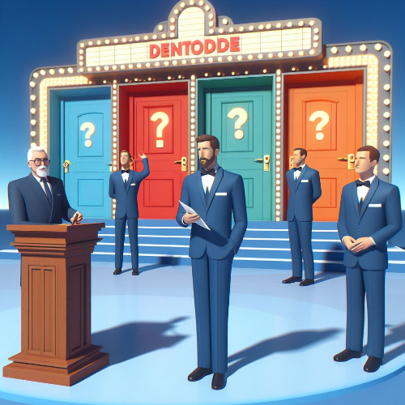

# Monty Hall Game Program



## Project Overview

The Monty Hall Game Program is a Python-based implementation of the classic Monty Hall problem. The program simulates the game where a contestant chooses one of three doors, behind one of which is a prize. After the contestant makes their initial choice, the host (Monty Hall) opens one of the other doors, revealing a goat. The contestant is then given the option to switch their choice. The program tracks the user's wins and losses, providing feedback on the outcome of each game.

## Features

- **User Interaction:**

  - Users choose a door and decide whether to switch after a door with a goat is revealed.

- **Difficulty Levels:**

  - Users can select the difficulty level (easy or hard) to influence Monty Hall's door-opening strategy.

- **Sound Effects:**

  - Incorporates sound effects to enhance the gaming experience (requires the pygame library).

- **Game Statistics:**
  - Displays game statistics, including the number of wins and losses.

## How to Play

1. **Run the Program:**

   - Execute the program to start the Monty Hall Game.

2. **Choose a Door:**

   - Enter the number of the door you choose (0, 1, or 2) when prompted.

3. **Select Difficulty Level:**

   - Choose the difficulty level ('easy' or 'hard') to influence Monty Hall's strategy.

4. **Switch or Stay:**

   - Decide whether to switch your choice after Monty Hall reveals a door with a goat.

5. **Game Outcome:**

   - The program will reveal the prize location and inform you if you've won or lost.

6. **Game Statistics:**

   - Track the number of wins and losses. Statistics are displayed after each game.

7. **Play Again:**

   - Choose whether to play another round. The program will loop until you decide to exit.

## Example

```bash
cd MontyHallGame
python monty_hall_game.py
```

```python
Welcome to the Monty Hall Game!

Choose a door (0, 1, or 2): 1
Choose the difficulty level (easy/hard): easy

Monty Hall opens door 2, revealing a goat!

Do you want to switch your choice? (yes/no): yes

--------------------------
Prize was behind door 0
You chose door 1
Monty Hall opened door 2

Congratulations! You've won the prize!

Statistics: Wins - 1, Losses - 0

Do you want to play again? (yes/no): yes
```

## Features to be Added

- **GUI Interface:**

  - Implement a graphical user interface for a more interactive experience.

- **Multiplayer Mode:**

  - Allow multiple users to play the Monty Hall game simultaneously.

- **Animation Effects:**

  - Incorporate visual effects, animations, or graphics to enhance the user interface.

- **Leaderboard:**

  - Add a leaderboard to track high scores and achievements.

- **Difficulty Adjustments:**

  - Fine-tune difficulty levels for a more challenging or relaxed gaming experience.

- **Customizable Sound Effects:**

  - Allow users to customize or mute sound effects based on preferences.

- **Dynamic Difficulty Scaling:**

  - Implement a system for dynamically adjusting difficulty based on the user's performance.

- **Machine Learning Integration:**

  - Explore the integration of machine learning algorithms for more advanced gameplay.

- **Interactive Tutorials:**

  - Provide interactive tutorials to guide users through the rules and strategies of the Monty Hall problem.

- **Localization Support:**

  - Enable support for multiple languages to make the game accessible to a broader audience.

## Contribution Guidelines

Contributions are welcome! If you have ideas for improvements or encounter any issues, please open an [issue](https://github.com/vrm-piyush/Acronym/issues) or refer to [contribution guidelines](../CONTRIBUTING.md) for more details.

---
