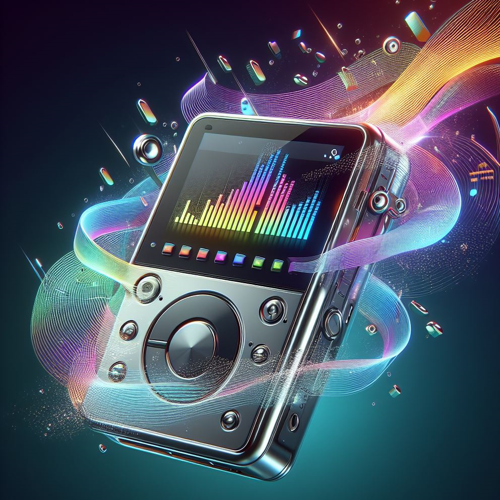
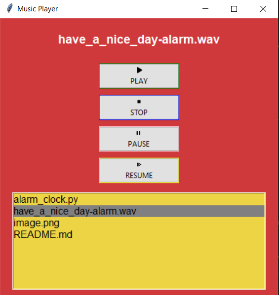

# Music Player GUI Program



## Project Overview

The Music Player GUI Program is a Python application built using the Tkinter library and pygame mixer to create an interactive music player interface. The program allows users to play, stop, pause, and resume songs, offering a user-friendly experience for managing and enjoying music.

## Features

- **GUI Initialization:**

  - Initializes and configures a music player GUI window using Tkinter, providing a visually appealing interface.

- **Directory Selection:**

  - Prompts the user to select a directory containing music files, allowing easy loading of songs.

- **Song Loading:**

  - Loads songs from the selected directory, creating a playlist for the user to choose from.

- **Play Controls:**

  - Implements functions for playing, stopping, pausing, and resuming songs, enhancing user control over playback.

- **Playlist Widget:**

  - Utilizes Tkinter's Listbox to create a playlist widget, displaying the list of available songs.

- **Button Icons:**

  - Integrates button icons for play, stop, pause, and resume actions, enhancing the visual appeal of the interface.

- **Customization:**
  - Customizes GUI components, styles, and button icons, creating a cohesive and visually pleasing design.

## How to Use

1. **Run the Program:**

   - Execute the program to launch the Music Player GUI.

2. **Select Music Directory:**

   - Upon launch, select a directory containing your music files.

3. **Play Songs:**

   - Use the provided buttons (Play, Stop, Pause, Resume) to control the playback of songs.

4. **Enjoy the Music:**
   - Explore the playlist, control playback, and enjoy your favorite tunes using the Music Player GUI.

## Example

```bash
cd MusicPlayerGUIProgram
python music_player_gui.py
```

\


---
## Features to be Added

- **Volume Control:**

  - Implement volume control buttons or a slider for users to adjust the volume.

- **Seekbar/Progress Bar:**

  - Add a seekbar or progress bar to display the current position of the playing song.

- **Next and Previous Buttons:**

  - Include buttons to skip to the next or previous song in the playlist.

- **Shuffle and Repeat:**

  - Implement options for shuffling the playlist and repeating songs.

- **Song Information:**

  - Display additional information about the currently playing song, such as artist, album, and duration.

- **Playlist Management:**

  - Allow users to create, save, and load playlists. Provide options to add or remove songs.

- **Visualizations:**

  - Integrate visualizations or a simple spectrum analyzer for a more engaging experience.

- **Themes and Styling:**

  - Implement different themes or styles to customize the appearance of the Music Player.

- **Keyboard Shortcuts:**
  - Provide keyboard shortcuts for common actions, enhancing user convenience.

## Contribution Guidelines

Contributions are welcome! If you have ideas for improvements or encounter any issues, please open an [issue](https://github.com/vrm-piyush/Acronym/issues) or refer to [contribution guidelines](../CONTRIBUTING.md) for more details.

---
