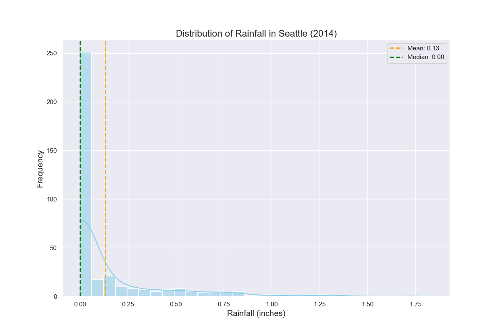

# Rainy Days Count in a Year Program


## Project Overview

The Rainy Days Count in a Year Program is designed to analyze and visualize rainfall data from a CSV file. This program provides various features to explore the distribution of rainfall, identify patterns, and perform statistical analysis. Additionally, it includes options for interactive visualization, machine learning prediction, and more.

## Features

- **Load and Preprocess Data:**

  - Load and preprocess CSV data, converting the date column to a datetime format.

- **Rainfall Histogram:**

  - Plot a histogram of rainfall distribution to observe the frequency of different rainfall levels.

- **Analyze Rainy Days:**

  - Provide statistics on rainy days, including the number of days without rain, with rain, and with specific rainfall thresholds.

- **Monthly Average Rainfall:**

  - Calculate and visualize the monthly average rainfall to understand seasonal variations.

- **Seasonal Analysis:**

  - Analyze and visualize rainfall patterns across different seasons (Winter, Spring, Summer, Fall).
  - Identify months with the highest and lowest rainfall.

- **Threshold Analysis:**

  - Categorize rainfall into light, moderate, and heavy rain.
  - Visualize the distribution of days falling into each category.

- **Trend Analysis:**

  - Explore trends or patterns in rainfall over the course of the year.
  - Apply statistical methods or regression analysis to identify any long-term trends.

- **Extreme Events Analysis:**

  - Identify and analyze extreme rainfall events or outliers.
  - Plot extreme events on a calendar or timeline.

- **Correlation Analysis:**

  - Explore correlations between rainfall and other meteorological factors such as temperature, humidity, or wind speed.

- **Interactive Rainfall Plot:**

  - Create an interactive rainfall visualization using Plotly Express.
  - Allow users to zoom in on specific periods and explore the data interactively.

- **Machine Learning Prediction:**

  - Explore machine learning models for predicting future rainfall based on historical data.
  - Evaluate the model's performance and visualize predictions.

## How to Use

1. **Run the Program:**

   - Execute the program to start receiving user input.

2. **Enter the choice:**

   - Input the number to view the plot.

3. **Interactive Visualization:**

   - The selected plot will be generated and displayed. Users can zoom and pan the plot for better exploration.

4. **Repeat or Exit:**

   - Users can repeat the process to explore different plots or exit the program.

## Example

```bash
cd RainyDays
python rainy_days.py
```

```python
Choose a plot to display:
1. Rainfall Histogram
2. Monthly Average Rainfall
3. Seasonal Analysis
4. Threshold Analysis
5. Trend Analysis
6. Extreme Events Analysis
7. Correlation Analysis
8. Interactive Rainfall Plot
9. Machine Learning Prediction
0. Exit
Enter the number of the plot you want to see (1-9): 1
```



## Installation

1. **Clone the Repository:**

   ```bash
   git clone https://github.com/vrm-piyush/RainyDays.git
   ```

2. **Navigate to the Project Directory:**

   ```bash
   cd RainyDays
   ```

3. **Run the Program:**

   ```bash
   python rainy_days.py
   ```

## Features to be Added

- **User Input:**

  - Allow users to input specific date ranges or locations for customized analysis.
  - Provide options to compare multiple years or locations.

- **Geospatial Analysis:**

  - If the dataset includes geographic information, create geospatial visualizations to show the distribution of rainfall across different locations.

- **Export Data:**

  - Implement functionality to export analyzed data or visualizations to different file formats (CSV, Excel, PDF).

- **Dashboard:**

  - Create a dashboard that combines various visualizations and statistics for a comprehensive overview of rainfall data.

## Contribution Guidelines

Contributions are welcome! If you have ideas for improvements, encounter any issues, or want to add new features, please open an [issue](https://github.com/vrm-piyush/RainyDays/issues) or submit a pull request.

---
