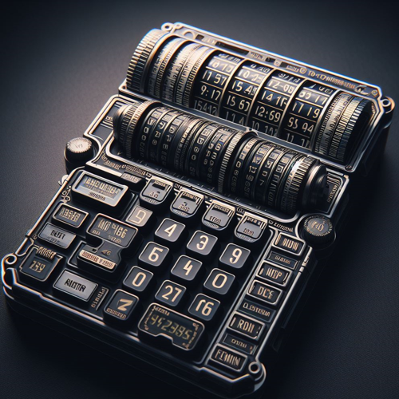
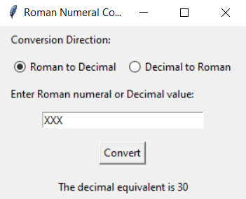

# Roman Numeral to Decimal and Decimal to Roman Numeral Converter (GUI)



## Project Overview

The Roman Numeral to Decimal and Decimal to Roman Numeral Converter GUI Program is a Python-based utility that provides a graphical user interface (GUI) for converting Roman numerals to decimal and vice versa. The program includes features such as input validation, correction of invalid Roman numeral patterns, handling negative decimal values, and presenting a clear and interactive interface.

## Features

- **Conversion Direction:**

  - Allows users to choose the conversion direction: Roman to Decimal or Decimal to Roman.

- **Input Validation:**

  - Validates the input Roman numeral for correctness using regular expressions.
  - Validates the input decimal value for a valid range.

- **Error Handling:**

  - Handles unexpected errors gracefully and provides informative messages to guide the user.

- **Correction of Invalid Patterns:**

  - Corrects invalid Roman numeral patterns during conversion for accurate results.

- **Negative Decimal Values:**

  - Handles negative decimal values and provides accurate Roman numeral representation.

- **Graphical User Interface (GUI):**
  - Provides a user-friendly interface with radio buttons for selecting the conversion direction.
  - Includes entry fields for user input and buttons for conversion.

## How to Use

1. **Run the Program:**

   - Execute the program to launch the GUI.

2. **Select Conversion Direction:**

   - Choose the desired conversion direction using the radio buttons (Roman to Decimal or Decimal to Roman).

3. **Enter Input:**

   - Enter the Roman numeral or decimal value in the input field.

4. **Perform Conversion:**

   - Click the "Convert" button to perform the conversion.

5. **View Result:**

   - The result of the conversion is displayed on the GUI.

6. **Handle Errors:**

   - If an error occurs, an informative message will be displayed on the GUI.

7. **Close the Program:**
   - Close the GUI to end the program.

## Example

```bash
cd RomanDecimalConverter
python roman_decimal_converter_gui.py
```

\


## Installation

1. **Clone the Repository:**

   ```bash
   git clone https://github.com/vrm-piyush/RomanDecimalConverter.git
   ```

2. **Navigate to the Project Directory:**

   ```bash
   cd RomanDecimalConverterGUI
   ```

3. **Run the Program:**

   ```bash
   python roman_decimal_converter_gui.py
   ```

## Features to be Added

- **Unit Tests:**

  - Implement unit tests to ensure the correctness of the conversion functions.

- **Conversion History:**

  - Maintain a history of conversions, allowing users to review their previous inputs and results.

- **Support for Lowercase Roman Numerals:**

  - Allow the user to input lowercase Roman numerals and handle the conversion appropriately.

- **Decimal Value Auto-Completion:**

  - Implement a feature that allows users to enter partial decimal values, and the program suggests and completes the full value.

## Contribution Guidelines

Contributions are welcome! If you have ideas for improvements or encounter any issues, please open an [issue](https://github.com/vrm-piyush/RomanDecimalConverterTerminal/issues) or submit a pull request.

---
