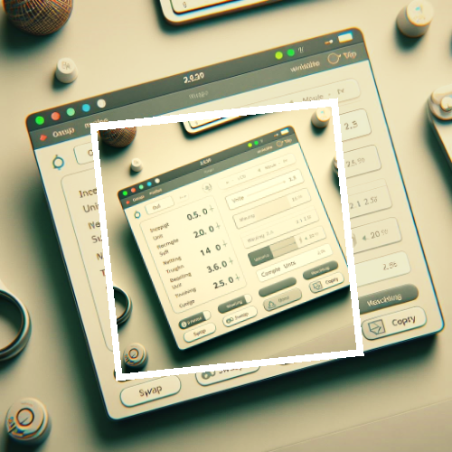
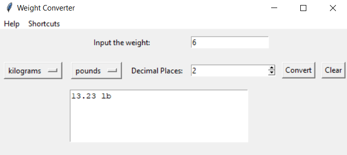

# Weight Converter GUI Program



## Project Overview

The Weight Converter GUI Program is a Python application designed to assist users in converting weights between different units. The program features a graphical user interface (GUI) built using the Tkinter library, providing a user-friendly experience for weight conversions. Users can input a weight, select the desired units for conversion, and specify the decimal places for the result.

## Features

- **Weight Input:**

  - Users can input weights for conversion.

- **Unit Selection:**

  - Dropdown menus allow users to choose both the input and output units for conversion.

- **Decimal Places:**

  - Users can specify the number of decimal places for the converted weight.

- **Conversion Button:**

  - A "Convert" button triggers the weight conversion process.

- **Result Display:**

  - The converted weight is displayed with the selected units and specified decimal places.

- **Error Handling:**

  - The application handles errors gracefully, providing informative messages for invalid inputs or unexpected issues.

- **Keyboard Shortcuts:**

  - Keyboard shortcuts (Ctrl+C for conversion, Ctrl+L for clearing fields) enhance user efficiency.

- **Menu Bar:**

  - A menu bar includes an "About" option to display information about the application.

## How to Use

1. **Run the Program:**

   - Execute the program to launch the Weight Converter GUI.

2. **Enter Weight:**

   - Input the weight in the designated field.

3. **Select Units:**

   - Choose both the input and output units for conversion using the dropdown menus.

4. **Decimal Places:**

   - Specify the number of decimal places for the converted weight.

5. **Convert:**

   - Click the "Convert" button or use the Ctrl+C shortcut to perform the weight conversion.

6. **View Result:**

   - The converted weight with the selected units and decimal places is displayed.

7. **Clear Fields:**

   - Click the "Clear" button or use the Ctrl+L shortcut to clear input and output fields.

8. **About Information:**
   - Access information about the application from the "Help" menu by selecting "About."

## Example

```bash
cd WeightConverter
python weight_converter.py
```



## Features to be Added

- **Conversion History:**

  - Keep a history of past conversions.

- **Theme and Style:**

  - Add a theme or style to the GUI for a visually appealing interface.

## Contribution Guidelines

Contributions are welcome! If you have ideas for improvements or encounter any issues, please open an [issue](https://github.com/vrm-piyush/Python-Projects/issues/new/choose) or refer to [contribution guidelines](../CONTRIBUTING.md) for more details.

---
