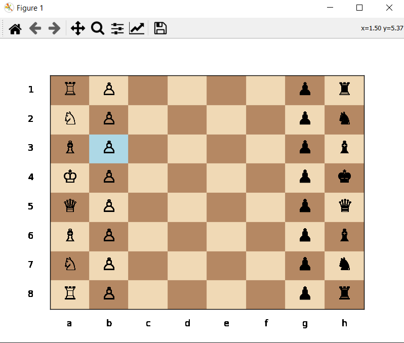

# Chessboard Program


## Project Overview

The Chessboard Program is a Python application that provides a graphical user interface (GUI) for displaying a chessboard. It allows users to place chess pieces. The program supports customization of colors for light squares, dark squares, and selected squares. Users can save and load board states, and the initial placement of standard chess pieces (pawns, rooks, knights, bishops, queens, and kings) is included. Additionally, users can customize chessboard colors using user-defined color codes.

## Features

- **GUI Interface:**

  - Provides a graphical user interface for interactive use.

- **Chess Piece Placement:**

  - Allows users to place chess pieces on the board.

- **Customizable Colors:**

  - Users can customize the colors for light squares, dark squares, and selected squares.

- **Save and Load Board States:**

  - Supports saving and loading board states to/from a file.

- **Initial Placement of Chess Pieces:**

  - Automatically places standard chess pieces at the beginning of the game.

- **Customization of Chessboard Colors:**
  - Allows users to define their own color codes for a personalized chessboard appearance.

## How to Use

1. **Run the Program:**

   - Execute the program to launch the Chessboard GUI.

2. **Chessboard Interface:**

   - The GUI displays the chessboard with customizable colors and initial placement of chess pieces.

3. **Piece Placement:**

   - Click on a square to place or move chess pieces interactively.

4. **Customization:**

   - Customize the colors of light squares, dark squares, and selected squares using user-defined color codes.

5. **Save and Load:**

   - Save the current board state to a file or load a board state from a file.

6. **Initial Placement:**

   - The program automatically places standard chess pieces at the beginning of the game.

## Example

```bash
cd ChessboardProgram
python chessboard.py
```

\


## Features to be Added

- **Interactive Chessboard:**

  - Allow users to interact with the chessboard, clicking on squares for actions.

- **Chess Notation:**

  - Display chess notation (e.g., algebraic notation) on the sides of the chessboard.

- **Move History:**

  - Implement a feature to record and display the move history.

- **Chess Logic:**

  - Integrate basic chess logic to validate moves, check for checkmate, or highlight legal moves.

- **Board Size Options:**

  - Provide options to change the size of the chessboard.

- **Coordinate Display:**

  - Display row and column indices on the chessboard.

- **Keyboard Shortcuts:**

  - Implement keyboard shortcuts for common actions.

- **Player vs. Player Mode:**

  - Enable a two-player mode where users can take turns making moves.

- **AI Opponent:**

  - Implement a simple AI opponent for a single-player mode.

## Contribution Guidelines

Contributions are welcome! If you have ideas for improvements or encounter any issues, please open an [issue](https://github.com/vrm-piyush/Python-Projects/issues/new/choose) or refer to [contribution guidelines](../../CONTRIBUTING.md) for more details.

---
