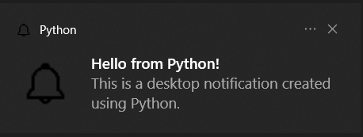

# Desktop Notification Program


## Project Overview

The Desktop Notification Program is a Python application that utilizes the Plyer library to display desktop notifications with customizable options. Users can receive notifications with a specified title and message, choose a custom icon, play a notification sound, set the notification duration, and even make the notification clickable, opening a specific URL upon interaction.

## Features

- **Desktop Notifications:**

  - The program generates desktop notifications with a title and message.

- **Customization Options:**

  - Users can customize the notification duration, providing flexibility in how long notifications stay on the screen.

- **Notification Sound:**

  - An option is available to play a notification sound when the notification appears.

- **Platform Compatibility:**

  - The program checks the platform (Windows, macOS, Linux) and adjusts the notification settings accordingly.

- **Persistent Notifications:**

  - Users can opt for notifications that remain on the screen until dismissed manually.

- **Clickable Notifications:**
  - Notifications can be made clickable, allowing users to open a specific URL or trigger an action upon clicking.

## How to Use

1. **Run the Program:**

   - Execute the program to demonstrate a sample desktop notification.

2. **Customize Notification (Optional):**

   - Modify the `title`, `message`, `duration`, `icon_path`, `sound_path`, `persistent`, `clickable`, and `url` parameters to tailor notifications.

3. **Provide Absolute Paths:**

   - Ensure accurate absolute paths are provided for the `icon_path` and `sound_path` variables.

4. **Check Platform Compatibility:**

   - Adjust platform-specific settings as needed, especially for Windows, macOS, and Linux.

5. **Run the Updated Program:**
   - After making customizations, run the program to observe the modified desktop notification.

## Example

```bash
cd DesktopNotificationProgram
python desktop_notification.py
```

\


## Features to be Added

- **Multiple Notification Styles:**

  - Implement different notification styles (e.g., informational, warning, error) with distinct visuals.

- **Dynamic Content:**

  - Allow dynamic content in notifications, such as displaying information retrieved from an external source.

- **Notification Queue:**

  - Implement a queue system for notifications to prevent overwhelming the user with multiple notifications at once.

- **Theming:**

  - Provide options for theming or styling notifications, allowing users to choose a visual style.

- **Cross-Platform Compatibility:**

  - Ensure that the program works seamlessly across different operating systems, improving its accessibility.

- **Notification History:**

  - Maintain a history of past notifications that users can review, enhancing user experience.

- **User Settings:**
  - Develop a simple settings interface to configure notification preferences, giving users more control.

## Contribution Guidelines

Contributions are welcome! If you have ideas for improvements or encounter any issues, please open an [issue](https://github.com/vrm-piyush/Python-Projects/issues/new/choose) or refer to [contribution guidelines](../../CONTRIBUTING.md) for more details.

---
