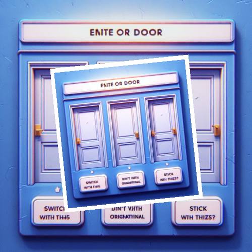

# Monty Hall Game Simulation Program



## Project Overview

The Monty Hall Game Simulation Program is a Python script that simulates the famous Monty Hall problem. The Monty Hall problem is a probability puzzle based on a game show scenario. In the game, a contestant is asked to choose one of three doors, behind one of which is a valuable prize. After the contestant makes their choice, the host, who knows what is behind each door, opens one of the remaining two doors, revealing an empty space. The contestant is then given the option to either stick with their original choice or switch to the other unopened door.

## Features

- **Monty Hall Game Simulation:**
  - Simulates the Monty Hall game for a specified number of trials.
  - Calculates and displays the winning percentage both with and without changing the initial choice.

## How to Run

1. **Clone the Repository:**

   ```bash
   git clone https://github.com/vrm-piyush/Python-Projects/blob/main/MontyHall/monty_hall_simulation.py
   ```

2. **Navigate to the Project Directory:**

   ```bash
   cd MontyHall
   ```

3. **Run the Program:**

   ```bash
   python monty_hall_simulation.py
   ```

## Example Output

```bash
Winning percentage without changing choice: 33.30%
Winning percentage while changing choice: 66.70%
```

## Simulation Details

The program runs a specified number of trials (default: 1,000,000) of the Monty Hall game. It randomly assigns the location of the prize behind one of the three doors and simulates the contestant's choices. The winning percentage is calculated both when the contestant sticks with their initial choice and when they decide to switch doors after one is revealed by the host.

## Contribution Guidelines

Contributions are welcome! If you have ideas for improvements or encounter any issues, please open an [issue](https://github.com/vrm-piyush/Python-Projects/issues/new/choose) or refer to [contribution guidelines](../../CONTRIBUTING.md) for more details.

---
