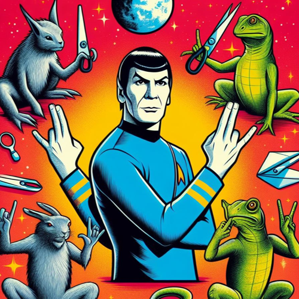

# Rock, Paper, Scissors Game



## Project Overview

The Rock, Paper, Scissors Game Program is a Python implementation of the classic game with additional features. Players can choose between Single Player Mode and Multiplayer Mode, and in Single Player Mode, they can select a difficulty level. The extended game includes choices beyond Rock, Paper, and Scissors, such as Lizard and Spock. The program displays ASCII art for the extended game choices and tracks historical statistics in Single Player Mode.

## Features

- **Game Modes:**

  - Offers a choice between Single Player Mode and Multiplayer Mode.

- **Difficulty Levels:**

  - In Single Player Mode, allows the player to select a difficulty level (easy, medium, hard).

- **Extended Game Choices:**

  - Implements an extended game with additional choices: Rock, Paper, Scissors, Lizard, Spock.

- **ASCII Art:**

  - Displays ASCII art for the extended game choices.

- **Score Tracking:**

  - Tracks and displays the historical statistics (Wins, Losses, Ties) in Single Player Mode.

- **Scores Reset:**

  - Allows players to reset scores at the end of each round or game.

- **Input Validation:**
  - Handles input validation for user choices.

## How to Play

1. **Run the Program:**

   - Execute the program and choose between Single Player Mode and Multiplayer Mode.

2. **Single Player Mode:**

   - If selected, choose the difficulty level (easy, medium, hard).

3. **Game Choices:**

   - Players choose among Rock, Paper, Scissors, Lizard, Spock.

4. **Results:**

   - The program displays the results of each round and the final scores.

5. **Reset Scores:**

   - Optionally, reset scores at the end of each round or game.

6. **ASCII Art:**
   - Enjoy ASCII art for the extended game choices.

## Example

```bash
cd RockPaperScissorsGame
python rock_paper_scissors_game.py
```

```python
Welcome to Rock, Paper, Scissors, Lizard, Spock Game!
Select a mode:
1. Single Player Mode
2. Multiplayer Mode
Enter the number of your choice: 1
Select difficulty level by entering the number (easy, medium, hard): easy

Welcome to Single Player Mode (Difficulty: Easy)!
Choose one of the following:
1. Rock
2. Paper
3. Scissors
4. Lizard
5. Spock
Type 'End' to exit the game.
Enter your choice: Rock
Computer's Choice: Scissors
You win!!! Rock beats Scissors

Round 1 Scores:
CPU: 0
Player: 1
Ties: 0

Do you want to reset scores? (y/n): n

Choose one of the following:
1. Rock
2. Paper
3. Scissors
4. Lizard
5. Spock
Type 'End' to exit the game.
Enter your choice: Paper
Computer's Choice: Paper
Tie!

Round 2 Scores:
CPU: 0
Player: 1
Ties: 1

Do you want to reset scores? (y/n): y

Scores reset to zero. Starting a new game.
```

## Features to be Added

- **Improved User Interface:**

  - Enhance the user interface with clear instructions and consider using ASCII art for the game choices.

- **Sound Effects:**

  - Add sound effects to make the game more engaging. For example, play a sound when the user wins, loses, or ties.

- **Graphics:**

  - Incorporate graphics to represent the choices visually, enhancing the overall gaming experience.

- **Time Delay:**

  - Introduce a brief time delay before revealing the computer's choice to build suspense.

- **Rule Variations:**

  - Allow the user to choose from different rule variations or create custom rule sets.

- **AI Improvements:**

  - Enhance the computer's decision-making process by implementing more sophisticated AI algorithms.

- **Save/Load Game:**

  - Allow users to save their current game state and resume later.

- **User Profiles:**
  - Let users create profiles to track their game statistics over multiple sessions.

## Contribution Guidelines

Contributions are welcome! If you have ideas for improvements or encounter any issues, please open an [issue](https://github.com/vrm-piyush/Python-Projects/issues/new/choose) or refer to [contribution guidelines](../../CONTRIBUTING.md) for more details.

---
