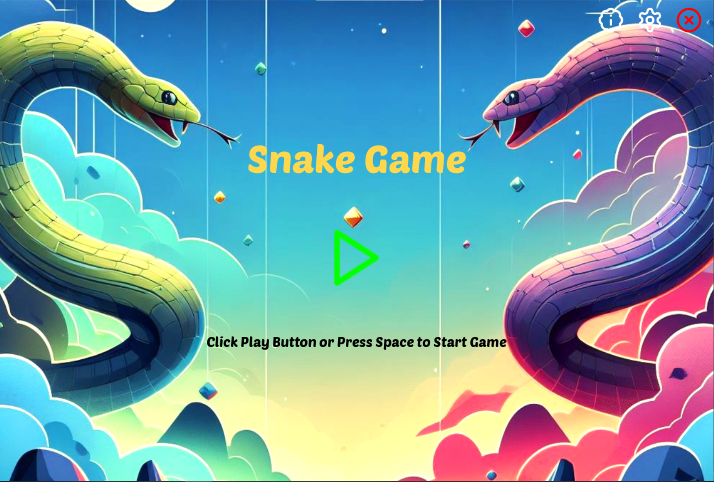

# SlitherQuest


## Table of Contents

- [Project Overview](#project-overview)
- [Features](#features)
- [Project Structure](#project-structure)
- [How to Play](#how-to-play)
- [Example](#example)
- [Installation](#installation)
- [Features to be Added](#features-to-be-added)
- [Contribution Guidelines](#contribution-guidelines)

## Project Overview

The SlitherQuest is a simple and enjoyable implementation of the classic SlitherQuest using Pygame. Players control a snake on a grid, eat apples to grow longer, and avoid collisions with the snake's own body and obstacles.

## Features

- **Levels:**

  - Multiple levels with increasing difficulty.

- **Pause and Resume:**

  - Pause and resume gameplay without losing progress.

- **Obstacles:**

  - Introduce obstacles for the snake to navigate around.

- **Sound Effects:**

  - Immersive sound effects based on in-game events.

- **Settings Menu:**

  - Customize game settings such as sound volume and difficulty.

- **Game Over Screen:**

  - Engaging summary of player performance.

## Project Structure

- `Main.py`: Main file containing the game's main logic.
- `Snake.py`: Snake class handling the snake's behavior.
- `Apple.py`: Apple class managing apple-related functions.
- `Settingsmenu.py`: SettingsMenu class for game settings customization.
- `Settings.py`: Configuration file with game constants and themes.
- `Graphics`: Folder containing Images

## How to Play

1. **Run the Script:**

   - Execute `main.py` script to start the game.

2. **Follow On-Screen Instructions:**

   - Press Space or click Play button to start the game.
   - Use arrow keys or configured controls to control the snake.

3. **Play the game:**

   - Eat apples to grow longer and avoid collisions.

4. **Clear Levels:**

   - Complete levels and achieve high scores.

## Example

```bash
cd Snake-Game
python Main.py
```

\


<video width="400" height="400" controls src="Output video/Snake_Game_Output.mp4" type="video/mp4">
</video>

## Features to be Added

- **Improve Responsive Controls:**

  - Smooth and precise snake movement controls.

- **Animations:**

  - Visual animations for various in-game events.

- **Achievements and Rewards:**

  - Challenges and rewards for specific milestones.

- **Customizable Snake:**

  - Personalize the snake's appearance.

- **Tutorial:**

  - In-game tutorial to guide new players.

- **Mobile Compatibility:**

  - Adapted for mobile devices with touch controls.

- **Multiplayer Mode:**

  - Local or online multiplayer mode.

- **Power-ups:**

  - Special items adding variability to the gameplay.

- **Randomized Apple Effects:**

  - Apple pickups with randomized effects.

- **Scoreboard:**

  - Persistent scoreboard tracking high scores.

## Contribution Guidelines

Contributions are welcome! If you have ideas for improvements or encounter any issues, please open an [issue](https://github.com/vrm-piyush/Python-Projects/issues/new/choose) or refer to [contribution guidelines](../../CONTRIBUTING.md) for more details.

---
