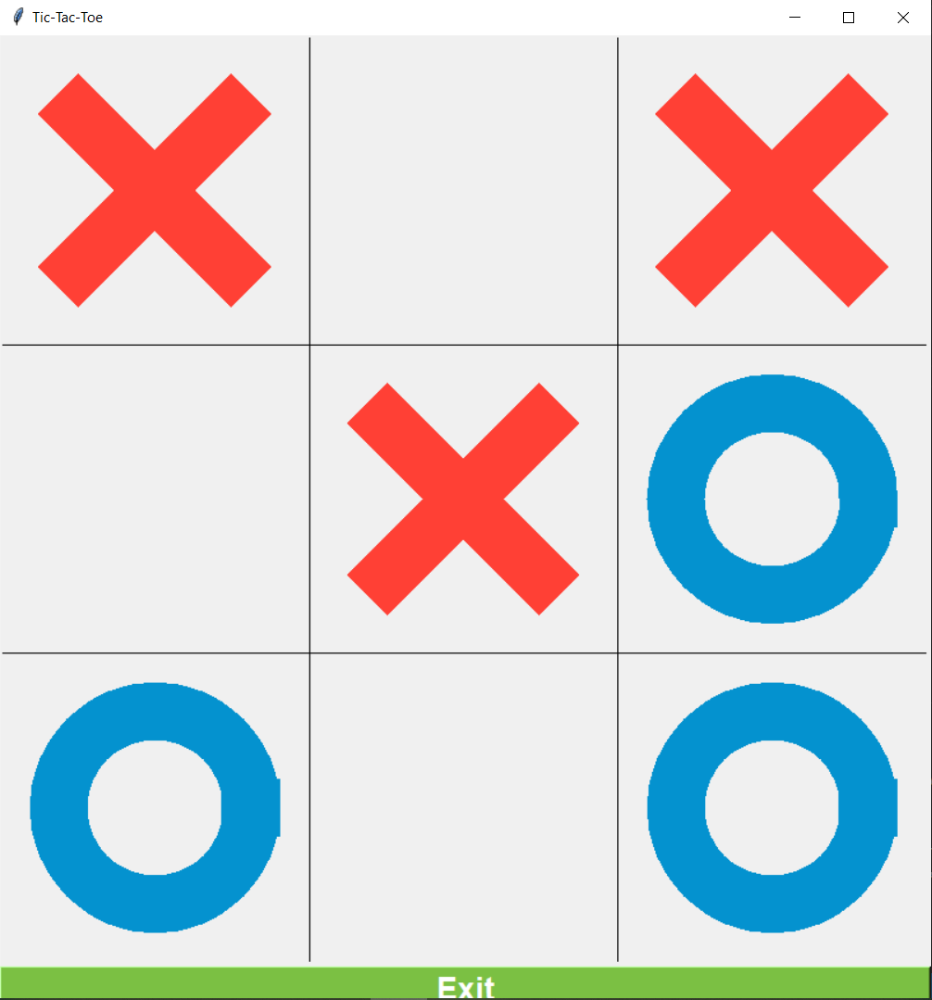

# Tic-Tac-Toe Game with GUI


## Project Overview

The Tic-Tac-Toe Game with GUI is a Python implementation of the classic Tic-Tac-Toe game. The program features a graphical user interface (GUI) that allows players to take turns clicking on the board to place 'X' or 'O'. The game displays the winner or a tie, updates the score, and provides an option to play again.

## Features

- **Player Interaction:**

  - Players use mouse clicks to place 'X' or 'O' on the board.

- **Winner Announcement:**

  - Displays a message indicating the winner or a tie result.

- **Score Tracking:**

  - Updates and displays the scores for each player.

- **Play Again Option:**

  - Allows players to initiate a new game by clicking on the board after the game ends.

- **Exit Button:**
  - Provides a button to close the game.

## How to Play

1. **Run the Program:**

   - Execute the program to launch the Tic-Tac-Toe game.

2. **Game Interface:**

   - The GUI presents a 3x3 grid for Tic-Tac-Toe.

3. **Player Turns:**

   - Players take turns clicking on an empty cell to place their symbol ('X' or 'O').

4. **Winner or Tie:**

   - The game determines the winner or announces a tie when a player achieves a winning combination or the board is filled.

5. **Score Display:**

   - Scores for each player are displayed, indicating the number of wins.

6. **Play Again:**

   - Players can click on the board to start a new game after the current game ends.

7. **Exit Game:**
   - The exit button allows players to close the game.

## Example

```bash
cd TicTacToeGame
python tic_tac_toe.py
```



## Features to be Added

- **Player Names:**

  - Allow players to input their names, and display them on the GUI.

- **Highlight Winning Combination:**

  - Highlight the winning combination of cells when a player wins.

- **Game Mode Selection:**

  - Implement different game modes, such as Player vs. Player, Player vs. AI, and AI vs. AI.

- **AI Difficulty Levels:**

  - If you implement an AI opponent, add difficulty levels (easy, medium, hard).

- **Sound Effects:**

  - Add sound effects for placing symbols, winning, and other game events.

- **Game Statistics:**

  - Keep track of and display statistics, such as the number of games played, wins for each player, and ties.

- **Responsive Design:**

  - Make the GUI responsive to different screen sizes and orientations.

- **Customizable Colors:**

  - Allow users to customize the colors of the board, symbols, and background.

- **Undo/Redo:**

  - Implement undo and redo functionality for moves during the game.

- **Animations:**

  - Add animations for symbol placement and winning sequences.

- **Save/Load Game:**

  - Allow users to save the game state and resume later.

- **Online Multiplayer:**

  - Implement an online multiplayer mode to play with friends over the internet.

- **AI Learning:**

  - Implement a machine learning-based AI opponent that learns and improves over time.

- **Timeouts:**

  - Add timeouts for moves to prevent slow or unresponsive players.

- **Help/Instructions:**
  - Provide in-game instructions and help to guide users on how to play.

## Contribution Guidelines

Contributions are welcome! If you have ideas for improvements or encounter any issues, please open an [issue](https://github.com/vrm-piyush/Python-Projects/issues/new/choose) or refer to [contribution guidelines](../../CONTRIBUTING.md) for more details.

---
